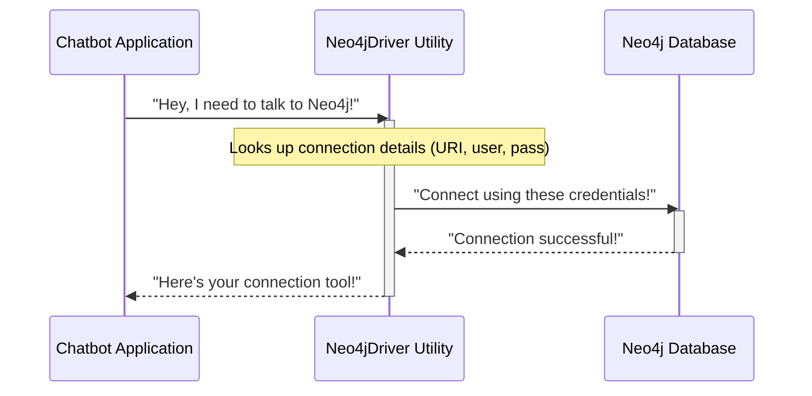

# Chapter 1: Neo4j Graph Database

Imagine you're building a super smart chatbot, but instead of just answering simple questions, you want it to truly understand complex information and remember how different pieces of knowledge are connected. Like a human brain, our chatbot needs a powerful way to store its "memories" and understand relationships between them. This is where the **Neo4j Graph Database** comes in!

### What is Neo4j and Why is it Like a Chatbot's Brain?

Think of your own brain. It doesn't store facts in separate, isolated lists. Instead, everything is interconnected. When you think of "apples," you might also think of "fruit," "red," "trees," "eating," and "juice." All these concepts are linked together.

Traditional databases often store information in tables, like a spreadsheet. While good for some tasks, this can make it hard and slow to find complex connections. For our chatbot, we need something that naturally represents relationships.

**Neo4j is a special type of database called a Graph Database.** It's designed specifically to store and manage highly connected data. It's the core storage for our chatbot's knowledge, acting like its long-term memory. Instead of traditional tables, it stores information as interconnected "nodes" (representing entities or concepts) and "relationships" (showing how these entities are linked).

### Key Concepts of a Graph Database

Let's break down the two main building blocks of a Neo4j graph:

1.  **Nodes**:
    *   **What they are:** Nodes are like the "nouns" or "entities" in your knowledge base. They represent things, people, places, concepts, or events.
    *   **Analogy:** In a social network, a node would be a person. In a map, a node could be a city. For our chatbot, a node could be a "Product," a "Customer," an "Issue," or a "Solution."
    *   **How they look:**
        ```mermaid
        graph TD
            A["Node: Chatbot"]
            B["Node: Neo4j"]
            C["Node: Knowledge"]
        ```

2.  **Relationships**:
    *   **What they are:** Relationships are the "verbs" that connect nodes. They describe how one node is related to another. Every relationship has a direction and a type, clearly explaining the connection.
    *   **Analogy:** In a social network, "FRIENDS_WITH" or "WORKS_AT" would be relationships. For our chatbot, relationships might be "USES," "SOLVES," "CREATED_BY," or "RELATED_TO."
    *   **How they look:**
        ```mermaid
        graph TD
            Chatbot["Node: Chatbot"] -->|USES| Neo4j["Node: Neo4j"]
            Neo4j -->|STORES| Knowledge["Node: Knowledge"]
        ```
        In this example, `USES` and `STORES` are relationships, showing how `Chatbot` interacts with `Neo4j`, and how `Neo4j` holds `Knowledge`.

### Why is this Structure Perfect for Our Chatbot?

Imagine you ask the chatbot: "What common issues are reported for product X, and what are the recommended solutions?"

If the chatbot's knowledge is stored in a graph, it can quickly traverse these connections:
*   Start at "Product X" (a node).
*   Follow "HAS_ISSUE" relationships to find all "Issue" nodes.
*   From those "Issue" nodes, follow "HAS_SOLUTION" relationships to find "Solution" nodes.

This interconnected structure makes it highly efficient for finding complex patterns and relationships, forming the foundation of the chatbot's understanding. It's like a vast, dynamic mind map where every piece of information is explicitly connected to others.

### Connecting Our Chatbot to Neo4j

Before our chatbot can store or retrieve any knowledge, it needs a way to connect to the Neo4j database. Our project uses a special "driver" to handle this connection.

Here's how we set up the connection:

First, we need to load our environment variables, which contain the Neo4j connection details (like its address, username, and password). This is typically done at the start of our application.

```python
# From knowledge_graph/graph.py
import os
from dotenv import load_dotenv, find_dotenv

# load the environment variables from .env file
load_dotenv(find_dotenv(), override=True)

# setup env:
os.environ["NEO4J_URI"] = os.getenv('NEO4J_URI')
os.environ["NEO4J_USERNAME"] = os.getenv('NEO4J_USERNAME')
os.environ["NEO4J_PASSWORD"] = os.getenv('NEO4J_PASSWORD')
```
This code snippet ensures that our program can find the necessary login details to access the Neo4j database. These details are usually kept in a hidden `.env` file for security.

Then, we use a utility function to get the Neo4j driver, which is the actual software that manages the connection to the database.

```python
# From knowledge_graph/graph.py
from langchain_community.graphs import Neo4jGraph

# Initializing The Graph
graph = Neo4jGraph()
```

The `Neo4jGraph()` object from `langchain_community` is a convenient tool that uses our Neo4j connection settings to make it easy to interact with the database. You'll see this `graph` object used a lot in future chapters!

### How the Connection Works (Under the Hood)

Let's quickly peek at how our application connects to Neo4j. It's managed by a special piece of code designed to handle the database connection cleanly.



The actual code responsible for creating and managing this connection is located in `utils/neo4j_driver.py`. It uses a pattern called a "singleton," meaning there's only one active connection to Neo4j at any given time, which helps manage resources efficiently.

```python
# From utils/neo4j_driver.py
from neo4j import GraphDatabase # The official Neo4j library

class Neo4jDriver:
    _instance = None # To ensure only one connection

    def __init__(self):
        # ... (error handling for multiple instances)
        self.driver = GraphDatabase.driver(
            uri=os.environ["NEO4J_URI"], # Database address
            auth=(os.environ["NEO4J_USERNAME"], os.environ["NEO4J_PASSWORD"]) # Login
        )
        Neo4jDriver._instance = self

    def get_driver(self):
        return self.driver

def get_neo4j_driver():
    # Gets the single active connection to Neo4j
    return Neo4jDriver.get_instance().get_driver()
```
This `get_neo4j_driver()` function is what `Neo4jGraph()` (and other parts of our chatbot) will call whenever it needs to send or receive information from the database.

### Graph Databases vs. Traditional Databases

To really appreciate why we're using Neo4j, let's look at a quick comparison:

| Feature             | Traditional (Relational) Database (e.g., MySQL) | Graph Database (Neo4j)                                    |
| :------------------ | :------------------------------------------------ | :-------------------------------------------------------- |
| **Data Storage**    | Tables with rows and columns                      | Nodes (things) and Relationships (connections)            |
| **Focus**           | Storing structured records                        | Storing and navigating relationships between data         |
| **Good For**        | Transactional data, fixed schemas                 | Highly interconnected data, complex relationship queries  |
| **Chatbot Use**     | Less efficient for finding complex context        | Excellent for understanding relationships and context     |
| **Analogy**         | Filing cabinet with separate folders              | Mind map or social network                                |

### Conclusion

In this chapter, we've learned that **Neo4j is a powerful graph database** that acts as the "brain" for our chatbot. It stores knowledge as interconnected **nodes** (entities/concepts) and **relationships** (links between them), allowing our chatbot to understand complex patterns and contexts efficiently. We also saw how our project connects to this database using the `Neo4jGraph()` object and the underlying `Neo4jDriver`.

Now that we understand where our chatbot's knowledge will be stored, the next crucial step is to get information *into* the database! In the next chapter, [Document Ingestion & Preprocessing](02_document_ingestion___preprocessing_.md), we'll explore how our chatbot takes raw text documents and prepares them to be transformed into this interconnected graph format.

---