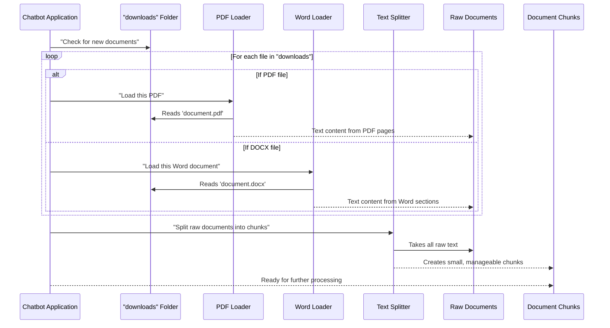

# Chapter 2: Document Ingestion & Preprocessing

Welcome back! In [Chapter 1: Neo4j Graph Database](01_neo4j_graph_database_.md), we learned that Neo4j acts like the powerful "brain" for our chatbot, storing knowledge in interconnected nodes and relationships. But how does this knowledge get into the brain in the first place? That's precisely what we'll explore in this chapter: **Document Ingestion & Preprocessing**.

### The Challenge: Raw Documents vs. Chatbot Brain

Imagine you have a big pile of research papers, user manuals, or company reports – all in different formats like PDFs and Word documents. Our chatbot's brain (the Neo4j database) can't just swallow these huge, unstructured files whole. It's like trying to eat a whole watermelon in one bite!

This is where "Document Ingestion & Preprocessing" comes in. It's the crucial first step to transform messy, real-world documents into something our chatbot can understand and learn from.

**What problem does it solve?**

Our chatbot needs to understand information from various sources to answer complex questions. But raw files are:
1.  **Too large:** A single PDF can be hundreds of pages. An LLM (Large Language Model) has limitations on how much text it can process at once.
2.  **Unstructured:** PDFs and Word docs contain images, formatting, tables, and lots of text, but they don't explicitly tell the chatbot "this sentence is about X" or "this paragraph is related to Y."

This component is like a very smart librarian and an expert note-taker rolled into one. It takes those new books (our documents), reads them, and then carefully organizes and highlights the most important parts so they can be easily digested and used.

### Key Concepts

Let's break down the two main parts of this process:

#### 1. Document Ingestion: Loading the Files

**What it is:** This is the process of loading raw input files (like PDFs and Word documents) from a specific location on your computer.

**Why it's important:** Before we can do anything with the text inside a document, we first need to actually *read* the document. This step extracts the raw text content from various file formats.

**Analogy:** Think of it as opening a book and scanning all its pages into a giant digital text file, ignoring the pictures and formatting for a moment.

Our project looks in a special folder called `downloads` for any files it needs to process.

#### 2. Document Preprocessing: Splitting into Chunks

**What it is:** After ingesting the documents, this step intelligently breaks down their content into smaller, more manageable pieces of text. We call these pieces "chunks."

**Why it's important:**
*   **LLM Limitations:** Large Language Models (like the ones powering our chatbot) have a "context window," meaning they can only process a certain amount of text at a time. If you feed them an entire book, they'll get confused or simply cut off the extra information.
*   **Graph Creation:** Smaller chunks are easier to analyze and convert into meaningful nodes and relationships in our Neo4j graph. Trying to make a graph from a whole document would be like trying to build a house with one giant, unwieldy brick!
*   **Relevance:** When the chatbot searches for answers, it's easier to find relevant information within a small, focused chunk rather than scanning an entire massive document.

**Analogy:** After scanning the book, our librarian now meticulously goes through the digital text and divides it into individual chapters, or even paragraphs, making each piece much easier to read, summarize, and understand its core topic.

### How Our Chatbot Ingests & Preprocesses Documents

Our chatbot has a dedicated function, `create_graph()`, which orchestrates the entire process of getting information from documents into the graph database. Let's look at the first two steps it takes.

First, we need to make sure our `downloads` folder exists where we'll place our documents:

```python
# From knowledge_graph/graph.py
import os

# Initialize the Uploads and Output directory
Uploader = 'downloads'
os.makedirs(Uploader, exist_ok=True)
```
This simple code ensures that a folder named `downloads` is ready to receive your PDF or Word documents.

Now, let's see how the chatbot starts the ingestion and preprocessing:

```python
# From knowledge_graph/graph.py (inside create_graph function)

def create_graph():
    try:
        # Step 1: Load the raw documents
        raw_document = load_document()
        print("document loaded")

        # Step 2: Split the raw documents into smaller chunks
        chunks = chunk_documents(raw_document)
        print("document chunked")

        # ... (further steps in later chapters)
        return "graph is loaded"
    except ValueError as e:
        raise ValueError(f"graph is not loaded: {e}")
```

When you call `create_graph()`, it first uses `load_document()` to read your files. Then, it uses `chunk_documents()` to break down the loaded content.

**Example Input:**
Imagine you put a `report.pdf` and a `manual.docx` file into your `downloads` folder.

**High-level Output:**
*   `load_document()` would return a list where each item represents the text content from a page of the PDF or a section of the Word document.
*   `chunk_documents()` would then take this list and turn it into many smaller text chunks, each carefully sized for processing.

### Under the Hood: A Peek at the Process

Let's understand what happens step-by-step when our chatbot ingests and preprocesses documents.



This diagram shows that our application scans the `downloads` folder. Depending on the file type, it uses a specialized loader to extract the text. All this extracted text forms our "raw documents." Finally, a "text splitter" component takes these raw documents and carves them into smaller, digestible "chunks."

#### Diving into the Code

Let's look at the actual code in `knowledge_graph/graph.py` that makes this happen.

##### 1. Loading the Documents (`load_document` function)

```python
# From knowledge_graph/graph.py
from langchain_community.document_loaders import PyMuPDFLoader, Docx2txtLoader
import os

def load_document():
    documents = []
    print('Loading the Documents!!!')
    # Loop through files in the 'downloads' folder
    for filename in os.listdir(Uploader):
        filepath = os.path.join(Uploader, filename)
        if filename.endswith('.pdf'):
            loader = PyMuPDFLoader(filepath) # Use PDF loader for .pdf files
        elif filename.endswith('.docx'):
            loader = Docx2txtLoader(filepath) # Use Word loader for .docx files
        else:
            continue  # Skip other file types
        documents.extend(loader.load()) # Add loaded content to our list
    print("Documents Loaded!!!")
    return documents
```

**Explanation:**
*   This function iterates through every file in our `downloads` folder (`Uploader`).
*   If it finds a file ending with `.pdf`, it uses `PyMuPDFLoader` (a tool specifically designed to read PDF files and extract their text).
*   If it finds a file ending with `.docx`, it uses `Docx2txtLoader` (for Word documents).
*   For any other file type, it simply skips them.
*   `loader.load()` does the actual work of reading the file and extracting the text content, usually splitting it by pages or logical sections.
*   All this extracted text content is collected into the `documents` list.

##### 2. Chunking the Documents (`chunk_documents` function)

```python
# From knowledge_graph/graph.py
from langchain.text_splitter import TokenTextSplitter

def chunk_documents(raw_documents):
    # Initialize the text splitter
    text_splitter = TokenTextSplitter(chunk_size=1536, chunk_overlap=250)
    # Split the raw documents into chunks
    documents = text_splitter.split_documents(raw_documents)
    return documents
```

**Explanation:**
*   Here, we use `TokenTextSplitter`, a smart tool that breaks text based on "tokens" (which are like words or punctuation marks).
*   `chunk_size=1536`: This tells the splitter to try and make each chunk about 1536 tokens long. This size is chosen to be optimal for many LLMs.
*   `chunk_overlap=250`: This is a clever trick! It means that each chunk will share a bit of text (250 tokens) with the previous chunk. Why? Imagine a sentence is split right in the middle of an important idea across two chunks. With overlap, that idea will appear in both chunks, ensuring no context is lost.
*   `text_splitter.split_documents(raw_documents)` then applies this splitting logic to all the raw text we loaded. The result is a list of smaller, more manageable text `documents` (our "chunks").

### Conclusion

In this chapter, we've explored the vital first steps in preparing information for our chatbot: **Document Ingestion & Preprocessing**. We learned how our system loads raw files like PDFs and Word documents, and then intelligently breaks them down into smaller, digestible "chunks." This process is crucial because it transforms large, unstructured data into a format that our chatbot (and the LLMs it uses) can effectively process and understand.

Now that we have our documents loaded and neatly chunked, the next exciting step is to turn these text chunks into the interconnected nodes and relationships that form our Neo4j knowledge graph. This is where the magic of AI comes in! In the next chapter, [LLM-powered Graph Transformation](03_llm_powered_graph_transformation_.md), we'll dive into how Large Language Models help us build this intelligent graph.

---