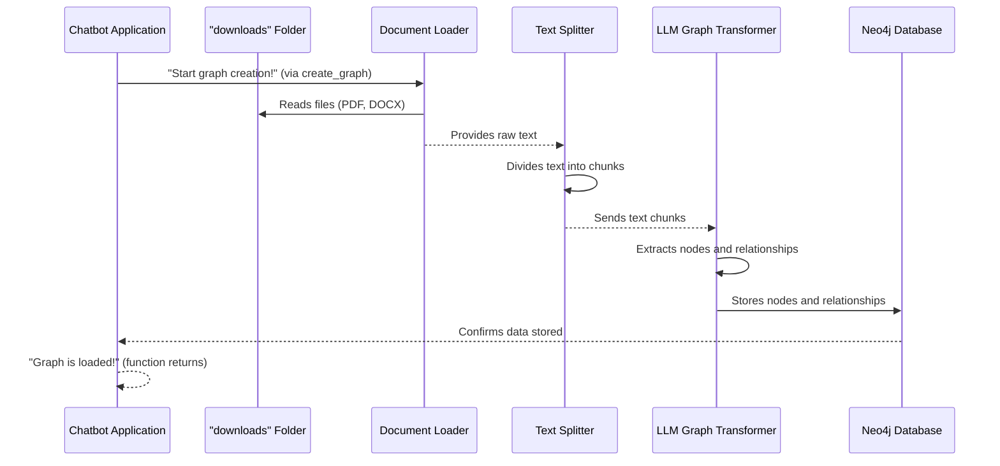

# Chapter 4: Knowledge Graph Population Workflow

Welcome back, future knowledge engineer! In our journey so far, we've learned about the brain of our chatbot ([Chapter 1: Neo4j Graph Database](01_neo4j_graph_database_.md)), how to prepare its food ([Chapter 2: Document Ingestion & Preprocessing](02_document_ingestion___preprocessing_.md)), and how to make that food digestible and intelligent using AI ([Chapter 3: LLM-powered Graph Transformation](03_llm_powered_graph_transformation_.md)).

Now, it's time to bring all these fantastic pieces together! Imagine you have a complex recipe, and you've prepared all the ingredients perfectly. The **Knowledge Graph Population Workflow** is like the final assembly line that takes all those prepared ingredients and systematically builds the complete dish – our intelligent knowledge graph.

### The Challenge: Assembling the Knowledge Graph

Our goal is to build a comprehensive knowledge graph from various documents, automatically. This isn't just one step; it's a sequence of interconnected operations:
1.  **Loading raw files.**
2.  **Breaking them into chunks.**
3.  **Using an LLM to find entities and relationships in those chunks.**
4.  **Storing these structured findings into our Neo4j database.**

The challenge is to make this entire process smooth, automated, and reliable. Without a clear workflow, it would be like trying to build a car by just throwing parts together randomly – messy and ineffective!

This workflow is the master plan, orchestrating every component into a unified, automated factory assembly line. It takes raw materials (your documents) and systematically crafts a complex, structured product (your knowledge graph).

### Key Concepts of the Workflow

The Knowledge Graph Population Workflow defines the entire pipeline for building and populating our graph. It glues together all the individual steps we've discussed:

#### 1. Orchestration: The Master Conductor
*   **What it is:** This is the idea of coordinating all the different steps in the right order. Like a conductor leading an orchestra, it ensures each part plays at the right time.
*   **Why it's important:** If steps happen out of order (e.g., trying to transform text before it's loaded), the whole process breaks down. Orchestration ensures a logical and efficient flow.
*   **Analogy:** It's the project manager for building our knowledge graph, making sure every team member (each step) knows what to do and when.

#### 2. Document Loading & Chunking (Input Stage)
*   **What it is:** The very first part of our assembly line. It involves reading raw documents and breaking them into smaller, manageable pieces.
*   **Connection to previous chapters:** This directly leverages what we learned in [Chapter 2: Document Ingestion & Preprocessing](02_document_ingestion___preprocessing_.md).
*   **Analogy:** Taking large logs (documents) and cutting them into manageable planks (chunks) at the start of the factory.

#### 3. LLM-powered Graph Transformation (Processing Stage)
*   **What it is:** Taking the prepared text chunks and using an intelligent Large Language Model (LLM) to extract valuable nodes and relationships.
*   **Connection to previous chapters:** This is the core intelligence component from [Chapter 3: LLM-powered Graph Transformation](03_llm_powered_graph_transformation_.md).
*   **Analogy:** Specialized machines that take the planks and carve them into specific parts (nodes and relationships) based on their design.

#### 4. Persistent Storage in Neo4j (Output Stage)
*   **What it is:** The final step, where all the extracted nodes and relationships are permanently saved into our Neo4j database.
*   **Connection to previous chapters:** This builds the "brain" structure we discussed in [Chapter 1: Neo4j Graph Database](01_neo4j_graph_database_.md).
*   **Analogy:** Taking all the carved parts and meticulously assembling them into the final product (the knowledge graph) and putting it into storage.

### How Our Chatbot Populates the Knowledge Graph

Our project has a central function, `create_graph()`, which is the entry point for this entire workflow. When you call this function, it orchestrates all the steps from raw documents to a populated Neo4j graph.

Let's see the `create_graph()` function, which acts as the conductor for our knowledge graph assembly line:

```python
# From knowledge_graph/graph.py

def create_graph():
    try:
        # Step 1: Load the raw documents from the 'downloads' folder
        raw_document = load_document()
        print("document loaded")

        # Step 2: Split the raw documents into smaller chunks
        chunks = chunk_documents(raw_document)
        print("document chunked")

        # Step 3: Use the LLM to convert chunks into graph elements
        graphs = graphstore(chunks)
        print("graphs loaded")

        return "graph is loaded"
    except ValueError as e:
        raise ValueError(f"graph is not loaded: {e}")
```

**Explanation:**
*   **`raw_document = load_document()`**: This line kicks off the process. It calls the `load_document()` function (from [Chapter 2](02_document_ingestion___preprocessing_.md)) to read all your PDF and Word files from the `downloads` folder.
*   **`chunks = chunk_documents(raw_document)`**: Next, it takes the `raw_document` content and passes it to `chunk_documents()` (also from [Chapter 2](02_document_ingestion___preprocessing_.md)). This function intelligently breaks the text into smaller, digestible chunks.
*   **`graphs = graphstore(chunks)`**: Finally, these `chunks` are sent to the `graphstore()` function. This is where the magic of [Chapter 3](03_llm_powered_graph_transformation_.md) happens, using the LLM to extract nodes and relationships, and then actually storing them in Neo4j.

**Example Input:**
You simply place your documents (e.g., `company_policy.pdf`, `product_manual.docx`) into the `downloads` folder. Then, you call `create_graph()`.

**High-level Output:**
When `create_graph()` runs successfully, you'll see messages like "document loaded," "document chunked," and "graphs loaded." Behind the scenes, your Neo4j database will be filled with interconnected nodes and relationships, forming your knowledge graph!

### Under the Hood: The Automated Assembly Line

Let's visualize this entire automated workflow, from raw documents to a populated Neo4j database.



This diagram shows how your `Chatbot Application` (through `create_graph`) orchestrates the entire process:
1.  It first tells the `Document Loader` to get text from files in the `downloads` folder.
2.  The `Document Loader` passes the raw text to the `Text Splitter`.
3.  The `Text Splitter` breaks it into chunks and sends them to the `LLM Graph Transformer`.
4.  The `LLM Graph Transformer` uses its intelligence to figure out the nodes and relationships.
5.  Finally, it sends these structured graph elements to the `Neo4j Database` for permanent storage.

#### Diving into the Code (The `graphstore` Function's Final Step)

While `load_document()` and `chunk_documents()` prepare the data, the `graphstore()` function in `knowledge_graph/graph.py` is where the graph *transformation* (using LLM) and *population* (storing in Neo4j) actually happen. We briefly touched on its transformation part in [Chapter 3](03_llm_powered_graph_transformation_.md). Now let's focus on the population part:

```python
# From knowledge_graph/graph.py

def graphstore(documents):
    print("Converting to graph from document:")
    # This part uses the LLM to extract nodes and relationships
    graph_documents = llm_transformer.convert_to_graph_documents(documents)
    print(f"Converted to graph document: {len(graph_documents)} graph documents")

    print("loading the graphs into the graph database...!!")
    # This is the crucial line that stores the extracted graph elements in Neo4j!
    graph.add_graph_documents(
        graph_documents,
        baseEntityLabel=True,
        include_source=True
    )
    print("Graphs are Stored:", graph_documents)
    return graph_documents
```

**Explanation:**
*   `graph_documents = llm_transformer.convert_to_graph_documents(documents)`: As we saw in Chapter 3, this line uses the LLM to analyze the `documents` (text chunks) and produce structured `graph_documents` (lists of nodes and relationships).
*   **`graph.add_graph_documents(...)`**: This is the ultimate step for population! The `graph` object (which represents our connection to Neo4j, as introduced in [Chapter 1: Neo4j Graph Database](01_neo4j_graph_database_.md)) is used here. Its `add_graph_documents` method takes the list of `graph_documents` and efficiently creates all the nodes and relationships in the Neo4j database.
    *   `baseEntityLabel=True`: This tells Neo4j to automatically add a general "Entity" label to all created nodes, which can be useful for general queries.
    *   `include_source=True`: This important setting ensures that the original text chunk from which the graph elements were extracted is also stored, linking the knowledge in the graph back to its source document.

This `graph.add_graph_documents()` method handles all the intricate details of talking to the Neo4j database, sending the correct commands to create the nodes and relationships based on the structured `graph_documents`.

### Conclusion

In this chapter, we've explored the complete **Knowledge Graph Population Workflow**. We've seen how `create_graph()` acts as the orchestrator, guiding raw documents through ingestion, chunking, LLM-powered transformation, and finally, persistent storage in our Neo4j database. This workflow is the automated assembly line that systematically builds our chatbot's intelligent memory.

Now that we understand the entire process of getting knowledge into our Neo4j graph, it's essential to understand how our application consistently and reliably talks to this database. In the next chapter, [Neo4j Connection Management](05_neo4j_connection_management_.md), we'll delve into the foundational aspects of setting up and maintaining a robust connection to our Neo4j database, ensuring smooth operations throughout this workflow.

---
