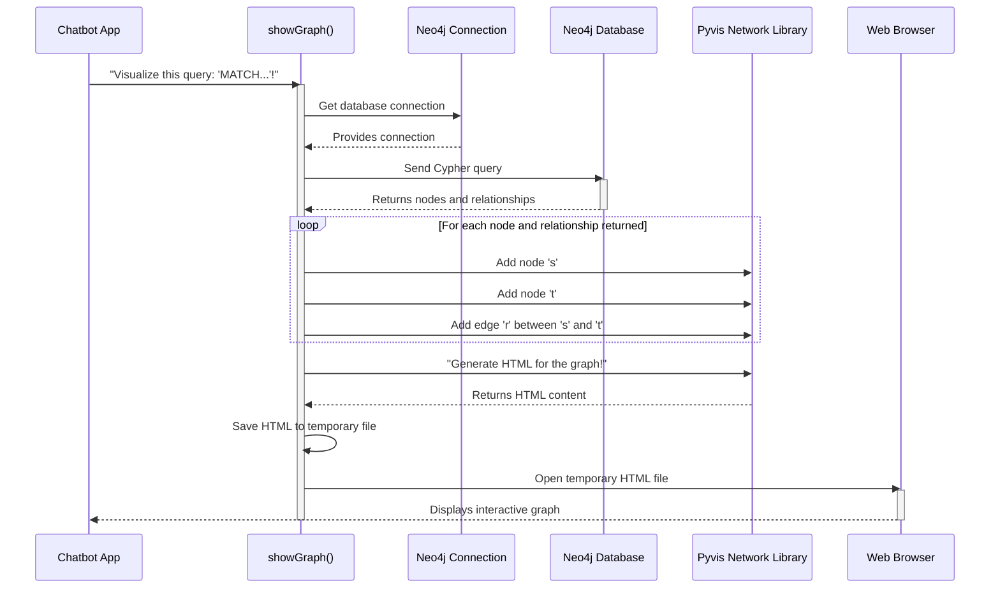

# Chapter 6: Graph Visualization

Welcome back, knowledge explorer! In our last chapter, [Neo4j Connection Management](05_neo4j_connection_management_.md), we ensured our chatbot has a rock-solid and efficient way to talk to our Neo4j knowledge graph. We've successfully built a sophisticated "brain" for our chatbot, filling it with interconnected nodes and relationships drawn from various documents.

But here's a thought: our database is full of amazing connections, but how do we actually *see* them? It's like having a treasure map, but it's written in code! This is where **Graph Visualization** comes in.

### The Challenge: Making Sense of Connections

Imagine asking your chatbot, "Show me everything related to 'Product X'." If the chatbot just gives you a list of text outputs like "Product X is made by Company Y," "Product X uses Material Z," and "Product X has Issue A," it's helpful, but hard to grasp the full picture quickly.

**The problem this component solves is transforming the abstract network of data within Neo4j into an easy-to-understand, interactive visual diagram.** It's like having a dynamic map-making tool that can instantly draw out all the connections in your "mind map," allowing users to see at a glance how different pieces of information are linked.

This makes complex relationships concrete and easy to grasp. Instead of reading a list, you get a visual layout where "Product X" is a central point, with lines (relationships) extending to "Company Y," "Material Z," and "Issue A."

### Key Concepts

Let's break down the essential ideas behind seeing our knowledge graph:

#### 1. Interactive Network Diagram: Your Dynamic Map
*   **What it is:** This is the core output of graph visualization. Instead of a static image, it's a diagram you can interact with. You can zoom in and out, pan around, and often click on elements to get more details.
*   **Why it's important:** Our knowledge graph is dynamic and complex. An interactive diagram allows you to explore vast networks of information without getting overwhelmed.
*   **Analogy:** Think of Google Maps. It doesn't just show you a static picture of a city; you can explore, zoom in on streets, and see how everything connects.

#### 2. Nodes as Visual Objects: The Things in Your Map
*   **What they are:** Each "node" (an entity or concept) from your Neo4j database is represented as a distinct shape on the screen, often a circle or a box.
*   **Why it's important:** These visual shapes make it easy to spot individual pieces of information, like "Product X," "Elon Musk," or "SpaceX," and distinguish them from the connections between them.
*   **Analogy:** These are like the individual landmarks, cities, or points of interest on your map.

#### 3. Relationships as Visual Links: The Connections Between Things
*   **What they are:** The "relationships" from your Neo4j database are drawn as lines or arrows connecting the visual nodes. These lines often have labels indicating the type of relationship (e.g., "CREATED_BY," "HAS_ISSUE") and a direction.
*   **Why it's important:** The lines explicitly show how different pieces of information are linked, revealing patterns and contexts instantly. The direction tells you "who did what to whom."
*   **Analogy:** These are the roads, rivers, or paths that connect the landmarks on your map, showing how to get from one point to another.

#### 4. Cypher Queries: Telling the Database What to Draw
*   **What they are:** Cypher is the special language used to talk to Neo4j. For visualization, you use Cypher to select *which* part of the graph you want to see.
*   **Why it's important:** Your knowledge graph might be huge! You usually don't want to draw the *entire* graph. Cypher allows you to focus on specific areas of interest.
*   **Analogy:** This is like telling your map app, "Show me restaurants near my current location," instead of trying to view every restaurant in the world.

### How Our Chatbot Visualizes the Graph

Our project uses a function called `showGraph(cypher: str)` in `knowledge_graph/graph.py` to create and display these interactive diagrams. This function takes a Cypher query as input, fetches the relevant graph data from Neo4j, and then uses a Python library called `pyvis` to draw it. Finally, it opens the resulting interactive diagram in your web browser!

Here's how you'd typically use it:

```python
# From knowledge_graph/graph.py (simplified)

# The 'graph' object helps us talk to Neo4j
# (initialized in previous chapters)

def showGraph(cypher: str):
    # This function uses a Cypher query to fetch graph data
    # and then displays it visually.
    # ... (implementation details inside) ...
    print(f"Executing Cypher query: {cypher}")

# Example: Display the first 50 nodes and their relationships
query_to_visualize = "MATCH (s)-[r]->(t) RETURN s, r, t LIMIT 50"
showGraph(query_to_visualize)
```

**Example Input:**
You provide a Cypher query string, like `MATCH (s)-[r]->(t) RETURN s, r, t LIMIT 50`. This query asks Neo4j to find any 50 relationships (`r`) between a source node (`s`) and a target node (`t`), and return all three.

**High-level Output:**
When `showGraph()` runs, your default web browser will automatically open a new tab. In this tab, you'll see an interactive network diagram showing the nodes and relationships that match your Cypher query. You can drag the nodes, zoom in and out, and hover over them to see more details!

### Under the Hood: Drawing Your Graph

Let's see the steps `showGraph` takes to turn a Cypher query into a visual diagram.



This diagram shows that our `Chatbot App` calls the `showGraph` function with a Cypher query. `showGraph` uses the `Neo4j Connection` to send the query to the `Neo4j Database`. The database sends back the relevant data (nodes and relationships). `showGraph` then feeds this data to the `Pyvis Network Library`, which builds a visual representation. Finally, `showGraph` saves this as an HTML file and opens it in your `Web Browser`.

#### Diving into the Code (`showGraph` function)

Let's look at the actual code in `knowledge_graph/graph.py` that powers the `showGraph` function.

```python
# From knowledge_graph/graph.py

# ... (other imports and initializations) ...
from pyvis.network import Network
import tempfile
import webbrowser
from utils.neo4j_driver import get_neo4j_driver # Our connection manager

def showGraph(cypher: str):
    driver = get_neo4j_driver() # 1. Get our Neo4j connection
    with driver.session() as session:
        result = session.run(cypher) # 2. Execute the Cypher query

        net = Network(notebook=True, height="800px", width="100%", directed=True) # 3. Create a Pyvis graph object

        for record in result: # 4. Process each returned node/relationship
            source = record["s"]
            target = record["t"]
            relation = record["r"]

            # Use 'name' or 'title' for node labels, 'id' for hover info
            source_label = source.get("name") or source.get("title") or source["id"]
            target_label = target.get("name") or target.get("title") or target["id"]
            relation_label = relation.type

            net.add_node(source.id, label=source_label, title=source["id"]) # Add source node
            net.add_node(target.id, label=target_label, title=target["id"]) # Add target node
            net.add_edge(source.id, target.id, title=relation_label, label=relation_label) # Add edge

    # 5. Save and open the graph in a temporary HTML file
    with tempfile.NamedTemporaryFile(delete=False, suffix=".html") as tmpfile:
        net.show(tmpfile.name)
        webbrowser.open("file://" + tmpfile.name)
```

**Explanation:**
1.  **`driver = get_neo4j_driver()`**: This line obtains our single, stable connection to the Neo4j database, as we learned in [Chapter 5: Neo4j Connection Management](05_neo4j_connection_management_.md).
2.  **`result = session.run(cypher)`**: The provided `cypher` query is executed against the Neo4j database. The `result` will contain all the nodes and relationships that match the query.
3.  **`net = Network(...)`**: An instance of `pyvis.network.Network` is created. This is the object that will hold our visual graph. `notebook=True` is often used when displaying graphs within environments like Jupyter notebooks, and `height`/`width` set the size of the visualization. `directed=True` makes the relationships show as arrows.
4.  **`for record in result:`**: The code then loops through each row of the `result` from the Neo4j query.
    *   `source`, `target`, `relation` are extracted from each record.
    *   `net.add_node(...)` and `net.add_edge(...)` are the core `pyvis` commands. They add visual representations of the nodes and the connecting relationships (edges) to our `net` object. We use properties like `name` or `title` for the visible label and the node's internal `id` for the hover title, making it easy to inspect.
5.  **`with tempfile.NamedTemporaryFile(...) as tmpfile:`**: Finally, the `net.show(tmpfile.name)` command tells `pyvis` to generate an HTML file containing the interactive graph. This file is saved to a temporary location on your computer.
    *   **`webbrowser.open("file://" + tmpfile.name)`**: This line then instructs your operating system to open this temporary HTML file using your default web browser, making the graph immediately visible and interactive.

### Conclusion

In this chapter, we've explored **Graph Visualization**, the component that brings our abstract knowledge graph to life. We learned how to use Cypher queries to select specific parts of our Neo4j database and how our `showGraph` function leverages libraries like `pyvis` to render interactive network diagrams directly in your web browser. This capability transforms raw data into understandable insights, making it much easier to explore and comprehend the complex relationships our chatbot has learned.

With all core components covered, from database setup to knowledge ingestion, transformation, storage, and now visualization, you have a solid understanding of how the `Neo4j-Python-ChatBot` project builds and interacts with its intelligent brain!

---
