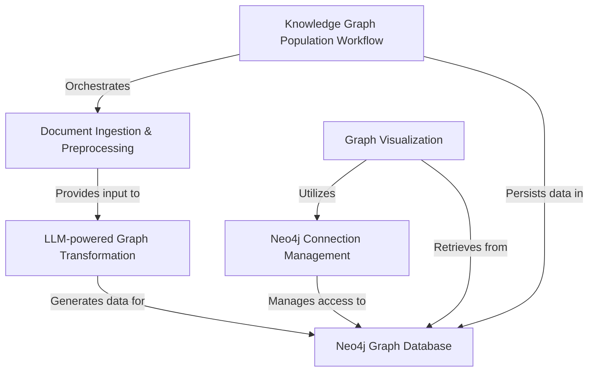

App Icon
Codebase to Tutorial
11.8K
Toggle theme
Neo4j-Python-ChatBot
Yogeshkumar-R/Neo4j-Python-ChatBot
english
gemini-2.5-flash
6f94923
Dec 7, 2025
Chapters
Overview of Neo4j-Python-ChatBot
Chapter 1: Neo4j Graph Database
Chapter 2: Document Ingestion & Preprocessing
Chapter 3: LLM-powered Graph Transformation
Chapter 4: Knowledge Graph Population Workflow
Chapter 5: Neo4j Connection Management
Chapter 6: Graph Visualization
Show Rendered
# Tutorial: Neo4j-Python-ChatBot

This project is a **Neo4j-Python-ChatBot** designed to build a *structured knowledge graph* from unstructured documents. It efficiently *ingests various file types* (like PDFs and Word documents), leverages *Large Language Models (LLMs)* to extract key entities and relationships from the text, and then stores this interconnected information within a **Neo4j graph database**. Users can then *visually explore* this knowledge graph, making complex data connections intuitive and easy to understand.

## Visual Overview

## Chapters

1. [Neo4j Graph Database
](01_neo4j_graph_database_.md)
2. [Document Ingestion & Preprocessing
](02_document_ingestion___preprocessing_.md)
3. [LLM-powered Graph Transformation
](03_llm_powered_graph_transformation_.md)
4. [Knowledge Graph Population Workflow
](04_knowledge_graph_population_workflow_.md)
5. [Neo4j Connection Management
](05_neo4j_connection_management_.md)
6. [Graph Visualization
](06_graph_visualization_.md)

---

Generated by [AI Codebase Knowledge Builder](https://github.com/The-Pocket/Tutorial-Codebase-Knowledge).
© 2025 Codebase to Tutorial. All rights reserved.
Terms of Service
Privacy Policy

Chat